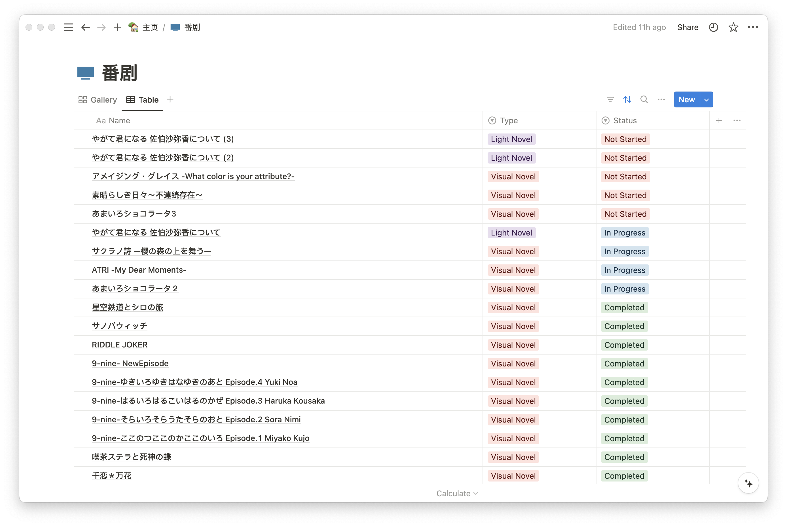

# anime-notion




Command line tool for keeping track of anime, comics, light novel, and visual novel in Notion.

## Usage

To use this tool, you will need

- a Notion API key, and need to make sure the API key have access to the database you want to use
- a Bangumi API key

You can get a Notion API key from [here](https://www.notion.so/my-integrations) and a Bangumi API key from [here](https://next.bgm.tv/demo/access-token).

### Installation

```shell
git clone https://github.com/BrandenXia/anime-notion.git
cd anime-notion
bun install
bun link
```

### Configuration

```shell
echo 'NOTION_TOKEN="your_notion_api_key"' > .env
echo 'BANGUMI_TOKEN="your_bangumi_api_key"' >> .env
```

### Commands

```
Usage: anime-notion [options] [command]

A CLI tool to dealing with anime data in Notion

Options:
  -h, --help                      display help for command

Commands:
  create <parentId> [title]       Create a new database in Notion
  add [options] <item>            Add items to Notion
  import [options] <type> <file>  Import data to Notion
  help [command]                  display help for command
```

### Create a database

```
Usage: anime-notion create [options] <parentId> [title]

Create a new database in Notion

Arguments:
  parentId    The ID of the parent page
  title       The title of the database (default: "番剧")

Options:
  -h, --help  display help for command
```

### Import data

```
Usage: anime-notion import [options] <type> <file>

Import data to Notion

Arguments:
  type                                  The type of data to import (choices: "text")
  file                                  The file to import

Options:
  -l, --limit [limit]                   The limit of items to import (default: 15)
  -s, --subject-type [subjectTypes...]  The types of subject(s) (choices: "Book", "Anime", "Music", "Game", "Real", default: All types)
  -o, --old-search                      Use the old search API, note that the old API doesn't support searching with multiple subject types, only
                                        the first type passed will be used
  -h, --help                            display help for command
```

### Add data

```
Usage: anime-notion add [options] <item>

Add items to Notion

Options:
  -l, --limit [limit]                   The limit of items to import (default: 15)
  -s, --subject-type [subjectTypes...]  The types of subject(s) (choices: "Book", "Anime", "Music", "Game", "Real", default: All types)
  -t, --status [status]                 The status of the item (choices: "Not Started", "In Progress", "Completed", default: "Not Started")
  -o, --old-search                      Use the old search API, note that the old API doesn't support searching with multiple subject types, only
                                        the first type passed will be used
  -h, --help                            display help for command
```
